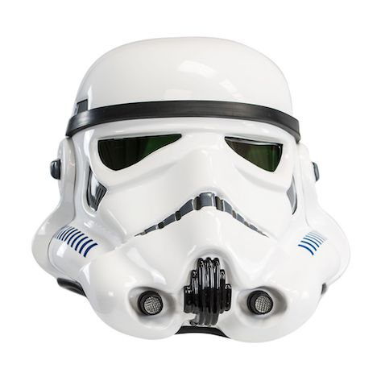

# Stormtrooper

[](https://www.npmjs.com/package/@theholocron/stormtrooper) [](https://github.com/the-holocron/stormtrooper/actions?workflow=CI) [](https://github.com/semantic-release/semantic-release) [](https://dependabot.com)

A Stormtrooper is a 100% clone for building out libraries within the Galaxy.



## Installation

```bash
npm install --save @theholocron/stormtrooper
```

## Table of Contents

* [Usage](#usage)
* [Browsers & Devices](#which-browsers-devices-we-support)
* [Documentation](#where-to-find-documentation)
* [Changelog](#how-we-track-changes)
* [Versioning](#how-we-version)
* [Contribution](#how-to-contribute)
* [Support](#where-to-find-suport)
* [Tools](#tools-we-use)
* [Support](#where-to-find-suport)
* [License](#license)

## Usage

// add in the carbon images for usage details

## Which Browsers & Devices We Support

We support the [latest, stable releases](https://browserl.ist/?q=%3E+5%25+in+US%2C+not+ie+11%2C+not+op_mini+all) of all major browsers and platforms based on the most [common usage from stats](./browserslist-stats.json) accumulated in Google Analytics. We use [caniuse.com](https://caniuse.com/) programmatically to determine support and [browserl.ist](http://browserl.ist/) to determine usage based on strings we provide. This technically translates to the [> ~0.03% in my stats](http://browserl.ist/?q=%3E+5%25++in+US), excluding IE11 and Opera Mini using **not ie 11, not op_mini all**.

| [](http://godban.github.io/browsers-support-badges/)<br>IE / Edge | [](http://godban.github.io/browsers-support-badges/)<br>Firefox | [](http://godban.github.io/browsers-support-badges/)<br>Chrome | [](http://godban.github.io/browsers-support-badges/)<br>Safari | [](http://godban.github.io/browsers-support-badges/)<br>iOS Safari | [](http://godban.github.io/browsers-support-badges/)<br>Opera |
| --------- | --------- | --------- | --------- | --------- | --------- |
| Edge| last 10 versions| last 8 versions| last 2 versions| last 2 versions| last 2 versions

Alternative browsers which use the latest version of WebKit, Blink, or Gecko, whether directly or via the platform's web view API, are not explicitly supported. However, it should (in most cases) display and function correctly in these browsers as well. More specific support information is provided below.

## Where to Find Documentation [](https://storybook.js.org/)

The best way to find out what's available is to check out the [source code](./src/) or [test](./test/) but you can also take a look at [the-holocron.github.io/stormtrooper](http://the-holocron.github.io/stormtrooper/) or the [README](./src/README.md) which have been generated by [SassDoc](http://sassdoc.com) and [`sassdoc-to-markdown`](https://github.com/hidoo/unit-sass/blob/master/packages/sassdoc-to-markdown).

## How We Track Changes [](https://keepachangelog.com/en/1.0.0/)

This project uses a [CHANGELOG](./CHANGELOG.md) and [GitHub releases](https://help.github.com/en/github/administering-a-repository/about-releases) which contains a curated, chronologically ordered list of notable changes for each version of a project. [Read more about changelogs](https://keepachangelog.com/en/1.0.0/).

## How We Version [](https://github.com/semantic-release/semantic-release)

We use [SemVer](https://semver.org/) for its versioning providing us an opt-in approach to releases. This means we add a version number according to the spec, as you see below. So rather than force developers to consume the latest and greatest, they can choose which version to consume and test any newer ones before upgrading. Please the read the spec as it goes into further detail.

Given a version number **MAJOR.MINOR.PATCH**, increment the:

* **MAJOR** version when you make incompatible API changes.
* **MINOR** version when you add functionality in a backward-compatible manner.
* **PATCH** version when you make backward-compatible bug fixes.

Additional labels for pre-release and build metadata are available as extensions to the **MAJOR.MINOR.PATCH** format.

## How to Contribute [](https://conventionalcommits.org)

Have a bug or a feature request? Looking to contribute to advance the project? Read our [contribution guide](./github/CONTRIBUTING.md) or [maintenance guide](./.github/MAINTAINING.md) first in order to understand how we do things around here. Or you could look at some of our other guides below:

<details>
  <summary><strong>How do I…</strong> (click to expand)</summary>

* [Ask or Say Something?](./.github/SUPPORT.md)
  * [Request Support](./.github/SUPPORT.md#request-support)
  * [Report an Error or Bug](./.github/SUPPORT.md#report-an-error-or-bug)
  * [Request a Feature](./.github/SUPPORT.md#request-a-feature)
* [Make Something?](./.github/CONTRIBUTING.md)
  * [Setup the Project](./.github/CONTRIBUTING.md#get-started)
  * [Create an Issue](./.github/CONTRIBUTING.md#creating-a-good-issue)
  * [Create a Feature Request](./.github/CONTRIBUTING.md#create-a-good-feature-request)
  * [Contribute Documentation](./.github/CONTRIBUTING.md#contribute-to-documentation)
  * [Contribute Code](./.github/CONTRIBUTING.md#create-a-pull-request)
  * [Join the Team](./.github/CONTRIBUTING.md#join-the-team)
* [Manage Something](./.github/MAINTAINING.md)
  * [Provide Support on Issues](./.github/MAINTAINING.md#provide-support-on-issues)
  * [Label Issues](./.github/MAINTAINING.md#label-issues)
  * [Clean Up Issues and PRs](./.github/MAINTAINING.md#clean-up-issues-and-prs)
  * [Create a Pull Request](./.github/MAINTAINING.md#create-a-pull-request)
  * [Review Pull Requests](./.github/MAINTAINING.md#review-pull-requests)
  * [Merge Pull Requests](./.github/MAINTAINING.md#merge-pull-requests)
  * [Tag a Release](./.github/MAINTAINING.md#tag-a-release)
  * [Release a Version](./.github/MAINTAINING.md#release-a-version)

</details>

:boom: Interested in how we decide things? Check out our [Mistakes We've Made](https://github.com/the-holocron/stormtrooper/wiki/Mistakes-We've-Made) document for an insight into the things we've considered.

## Where to Find Support [](code_of_conduct.md)

Looking to talk to someone or need some help? Please read our [support guidelines](./.github/SUPPORT.md).

## Tools We Use

* [Browserslist](https://github.com/browserslist/browserslist) - Used to share to our code which browsers we support
* [Carbon](https://carbon.now.sh/) - Used to generate the code examples in this README
* [Conventional Changelog](https://github.com/conventional-changelog/conventional-changelog) - Used to generate our CHANGELOG
* [Husky](https://github.com/typicode/husky) - Used for auto-fixing linting errors on each commit
* [Semantic Release](https://semantic-release.gitbook.io/semantic-release/) - Used for automating and releasing our library
* [StorybookJS](https://storybook.js.org/) - Used for building out our interactive docs
* [@godban's Browser Support Badges](https://godban.github.io/browsers-support-badges) - The tool used to generate the "Which Browsers [sic] We Support" section

## References

* [Conventional Commits](https://www.conventionalcommits.org/en/v1.0.0/) - For how we format commit messages
* [Contributor Convenant](https://www.contributor-covenant.org)
* [Keep a Changelog](https://keepachangelog.com/en/1.0.0/) - For building out a quality CHANGELOG
* [Make a README](https://www.makeareadme.com/) - For building out this README
* [SemVer](https://semver.org/) - For versioning this library

## License [](https://www.gnu.org/licenses/gpl-3.0)

©2020 GNU General Public License v3. See [LICENSE](./LICENSE.md) for specifics.
